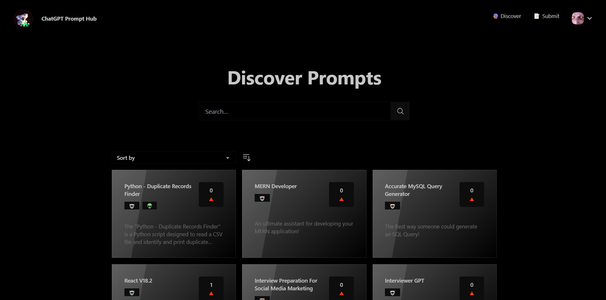
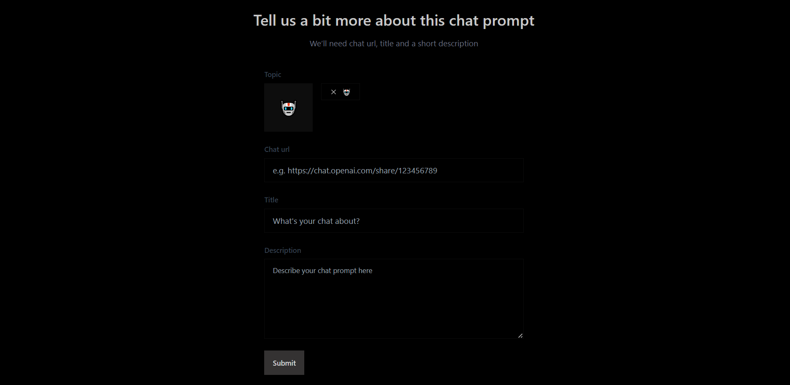
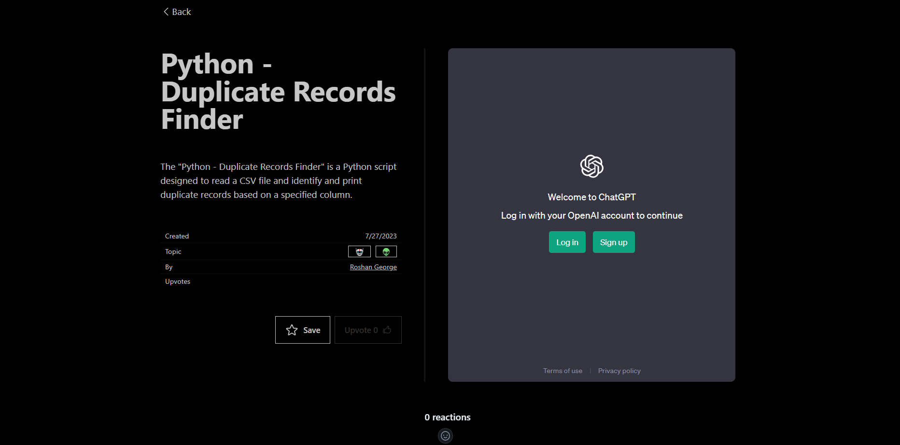
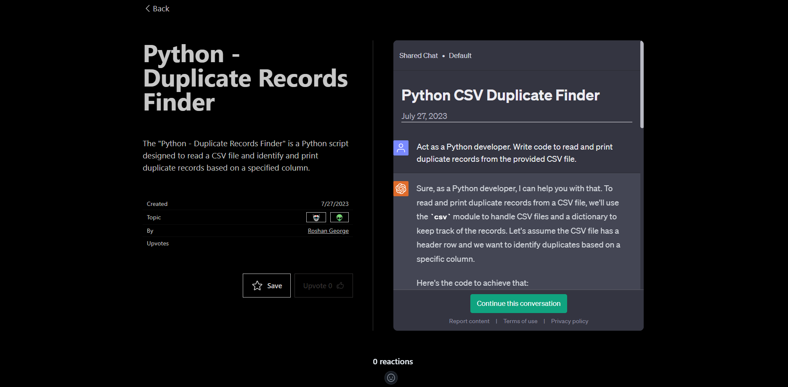
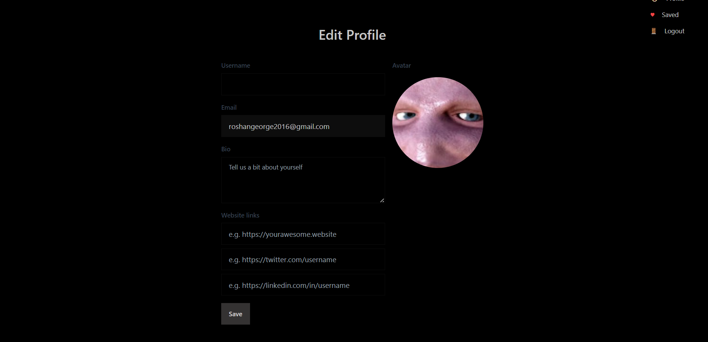

# PromptHub - Supercharging AI Interactions

## Inspiration

The inspiration for PromptHub came from recognizing the challenges faced by developers, content creators, startups, and prompt engineers in effectively interacting with language models. We were motivated to create a platform that simplifies prompt creation, fosters collaboration, and provides a curated repository of successful prompts for a diverse range of use cases.

## What It Does

PromptHub is a collaborative platform that empowers AI enthusiasts to supercharge their AI interactions. The platform offers a repository of carefully curated prompts that have been tested and proven to work effectively with various language models. It serves as a one-stop destination for programmers seeking version-compatible prompts, content creators looking for SEO-optimized prompts, startups prototyping AI-powered virtual assistants, and researchers exploring multilingual and privacy-preserving prompts.

## Screenshots

## Tech Stack

To develop PromptHub, we utilized the following tech stack:

- Frontend: Next.js
- Backend: Prisma template integrated with the TiDB Cloud cluster
- API Integration: OpenAI API

## Challenges We Ran Into

One of the main challenges we encountered was integrating the MySQL database on the TiDB cluster to Prisma. Due to limited documentation, it took time and effort to figure out the correct implementation, but eventually, we successfully connected and stored ChatPrompts and other schemas in the database.

## Accomplishments That We're Proud Of

We take pride in successfully connecting to the database and integrating the OpenAI API into our codebase, enhancing PromptHub's functionality and AI capabilities. Additionally, creating a user-friendly interface and building a collaborative community of AI enthusiasts are significant accomplishments that we are proud of.

## What We Learned

Throughout the development of PromptHub, we learned valuable lessons about the power of collaboration and knowledge sharing among AI enthusiasts. Understanding the diverse needs of different user groups allowed us to design tailored features that cater to specific use cases. We also gained insights into ethical prompt creation and responsible AI usage.

## What's Next for PromptHub

Looking ahead, our vision for PromptHub involves transforming it into a platform akin to GitHub, where users can fork and contribute to open-source prompts, enhancing the accuracy and effectiveness of prompts. We plan to expand PromptHub's offerings to cover additional language models and foster an even more vibrant and supportive community of AI enthusiasts. Continuously improving and innovating, we aim to make PromptHub the go-to destination for all AI interaction needs.

---

## Get Started

To get started with PromptHub, follow these steps:

1. Clone the repository.
2. Install the required dependencies using `npm install`. 
3. Run the development server with `npm run dev`.
4. Explore the curated prompts, share your own successful prompts, and engage with the community!

## Contributing

We welcome contributions from the community to enhance PromptHub further. If you have any ideas, feature requests, or bug reports, please feel free to open an issue or submit a pull request. Together, we can make PromptHub an even more powerful tool for AI enthusiasts worldwide.

## License

PromptHub is licensed under the [MIT License](LICENSE).
